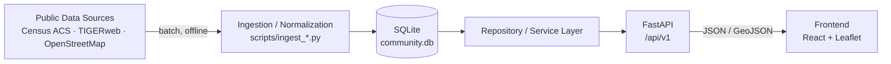

# Community Intelligence API

Backend for the Silver Spring Community Census — community intelligence for
**Fenton Village, Silver Spring, Maryland**, built for local business owners.

## The problem

A shop owner on Fenton Street has questions a spreadsheet won't answer: *Who
lives here? Can they afford my price point? Do they walk past my door or drive
past it? What already exists on this block?*

Public data holds the answers — but it's spread across the Census API,
TIGER/Line geography and OpenStreetMap, in formats nobody reads for fun. This
backend turns those into one queryable, **fully cited** API. Every number it
returns can be traced to a dataset, a year, a geography and a variable.

## Architecture



**Runtime requests never touch a public API.** Ingestion is a deliberate,
offline step; serving reads only from SQLite. This matters for two reasons:

1. **Demo reliability.** Overpass rate-limits and occasionally goes down; the
   Census API is slow for large tract queries. A page load that depended on
   either could fail live on stage. Ours cannot.
2. **Provenance.** Each ingestion run records *which* dataset release it
   read, so a value served weeks later still cites the exact source it came
   from rather than whatever the upstream API says today.

## Data flow

```
public datasets → ingestion → normalization → storage → service/query → REST API → frontend
```

| Stage | Where | Responsibility |
|---|---|---|
| Fetch | `app/integrations/` | HTTP only, explicit timeouts, no DB access |
| Normalize | `transform.py`, `osm_categories.py` | Raw payloads → canonical records |
| Store | `app/models/`, `app/repositories/` | SQLAlchemy, idempotent upserts |
| Query | `app/services/` | Aggregation, evidence assembly |
| Serve | `app/api/v1/` | HTTP translation only — no SQL in handlers |

## Data sources

| Source | Used for | Key? |
|---|---|---|
| [Census ACS 5-Year 2024](https://api.census.gov/data/2024/acs/acs5) | Demographic, economic, housing and commuting metrics | `CENSUS_API_KEY` recommended/required by current Census access policy |
| [Census TIGERweb](https://tigerweb.geo.census.gov/arcgis/rest/services/TIGERweb/tigerWMS_ACS2024/MapServer/8) (ACS 2024 vintage) | Tract boundaries as GeoJSON | No |
| [OpenStreetMap](https://www.openstreetmap.org/copyright) via Overpass | Business and service POIs | No |

**No API key is required to run this project.** TIGERweb is pinned to the
**ACS 2024 vintage** so boundaries match the estimates drawn on them — pairing
2024 figures with "current" boundaries would silently mismatch areas.

## Census variables used

Every ID and label below was read from the live Census metadata API
(`/2024/acs/acs5/groups/<GROUP>.json`) rather than recalled, and is
centralized in [`app/integrations/census/variables.py`](app/integrations/census/variables.py)
— the only file to change when a release renames a variable.

| Concept | Variables | Why a business owner cares |
|---|---|---|
| Population | `B01003_001E` | Market size |
| Median household income | `B19013_001E` | Price point (2024 dollars) |
| Median age | `B01002_001E` | Product mix |
| Young adults 18–34 | `B01001_007–012E`, `_031–036E` | Evening and weekend trade |
| Housing tenure | `B25003_001/002/003E` | Renters churn; owners stay |
| Commute mode | `B08301_001/003/004/010/018/019/021E` | **Foot traffic past the door** |
| Educational attainment | `B15003_001E`, `_022–025E` | Spending profile |
| Household language | `C16002_001E`, `_002E` | Signage and staffing languages |

33 variables → **24 stored metrics** per geography, including derived shares.
Age needs twelve cells because ACS splits age by sex and brackets 18–19, 20,
21, 22–24, 25–29 and 30–34 separately; `B15003` and `C16002` bases
are stored separately so aggregate shares use the correct denominator.

## Evidence and provenance strategy

The central design decision: **`data_source_id` is a NOT NULL foreign key** on
both fact tables. An unsourced metric or business is not discouraged — it is
*unrepresentable*. Evidence is a schema constraint, not a convention.

Every data-derived value carries `dataset`, `dataset_year`, `source_variable`,
`source_url` and `organization`. Three further rules:

- **Derived metrics store their full formula**, so any figure is reproducible
  from the published tables, e.g.
  `(B15003_022E + ... + B15003_025E) / B15003_001E * 100`.
- **Boundaries cite separately from statistics.** They are different products
  with different vintages, so `boundary_source` is distinct from each metric's
  `evidence`.
- **Missing stays missing.** The Census suppresses small-population
  estimates; those are stored as `NULL` and reported as unavailable. `null`
  never means zero.

## API

Base URL: `http://localhost:8000` · Swagger: `/docs` · Schema: `/openapi.json`

| Method | Path | Returns |
|---|---|---|
| `GET` | `/health` | Liveness (unversioned) |
| `GET` | `/api/v1/areas` | Areas; `?with_boundary_only=true` → the 14 mappable tracts |
| `GET` | `/api/v1/areas/{geoid}` | One area |
| `GET` | `/api/v1/areas/{geoid}/metrics` | 24 metrics, each with evidence |
| `GET` | `/api/v1/businesses` | Businesses; `?category=`, `?q=`, `?limit=` |
| `GET` | `/api/v1/businesses/categories` | Categories present, with counts |
| `GET` | `/api/v1/map/community` | Both map layers as GeoJSON |
| `GET` | `/api/v1/insights/fenton-village` | Deterministic district summary |
| `GET` | `/api/v1/opportunities?category=Cafe` | Competition and Census context; never a success score |
| `POST` | `/api/v1/query` | Constrained natural-language question |

Unversioned `/businesses` and `/geographies` remain hidden compatibility routes
for older clients and tests. New clients must use `/api/v1`.

### Conventions

- **Join on `geoid`, never `name`** — tract names are neither unique nor
  stable across ACS vintages.
- **`null` means "not available", never zero.**
- **Empty result is `200`, not `404`.** Only an unknown GEOID is a 404.
- **GeoJSON is `[longitude, latitude]`** (RFC 7946) — the reverse of Leaflet's
  `[lat, lng]`. `L.geoJSON` converts; hand-built markers do not.

### Examples

Real responses, trimmed.

**`GET /api/v1/areas/24031701701/metrics`**

```json
{
  "area": { "geoid": "24031701701", "name": "Census Tract 7017.01; Montgomery County; Maryland", "has_boundary": true },
  "count": 24,
  "metrics": [
    {
      "metric_key": "median_household_income",
      "value": 111411.0,
      "unit": "usd",
      "evidence": {
        "dataset": "American Community Survey 5-Year Estimates (2024)",
        "dataset_year": 2024,
        "source_variable": "B19013_001E",
        "source_url": "https://api.census.gov/data/2024/acs/acs5",
        "organization": "US Census Bureau"
      }
    }
  ]
}
```

**`GET /api/v1/businesses?category=Cafe&limit=1`**

```json
{
  "businesses": [
    {
      "id": 174, "name": "'TIS Corner Cafe", "category": "Cafe",
      "latitude": 38.9925641, "longitude": -77.0309487,
      "address": "1317 East-West Highway, 20910",
      "source": "OpenStreetMap contributors (node/14118971901)",
      "source_url": "https://www.openstreetmap.org/copyright",
      "external_id": "node/14118971901", "source_tag": "amenity=cafe",
      "dataset": "OpenStreetMap POIs via Overpass API"
    }
  ]
}
```

**`GET /api/v1/businesses/categories`** → `{"count": 10, "categories": [{"category": "Restaurant", "count": 77}, ...]}`

**`GET /api/v1/map/community`** → two GeoJSON `FeatureCollection`s: `areas`
(tract polygons with metrics) and `businesses` (points with attribution), plus
`area_count` and `business_count`. Separate because the layers draw
differently — choropleth vs markers.

**`GET /api/v1/insights/fenton-village`** — deterministic observations:

```
Restaurant is the largest business category in the current dataset, with 77 of 207
mapped establishments (37.2%).
Renter-occupied households are 64.01% of occupied housing units (16,587 of 25,913).
20.22% of workers commute by public transport, walking or cycling (6,763 of 33,452).
Median household income varies across the 14 tracts, from $84,167 to $197,894.
```

No recommendations, no causal claims, no invented statistics. Sections are
`study_area`, `community_snapshot`, `ranges`, `business_landscape`,
`observations` and `unavailable`.

**`POST /api/v1/query`** — `{"question": "How many cafes are nearby?"}`

```json
{
  "understood": true,
  "parsed": { "intent": "nearby_businesses", "geography": "fenton-village", "business_category": "Cafe" },
  "answer": "15 of 207 mapped establishments in the study area are in the category 'Cafe'.",
  "businesses": [ "..." ], "metrics": [], "map": { "...": "..." },
  "evidence": [ "..." ], "limitations": [ "..." ]
}
```

**Not a chatbot.** A question maps to one of eight intents, the intent selects
a fixed set of database reads, and the answer is assembled by templates from
the values returned. Parsing is deterministic keyword matching — no model is
configured, so it works offline. If one were configured it could only return
an intent, a geography and a category; the schema forbids extra fields, so it
cannot supply a statistic. No SQL is generated.

Unsupported questions return `understood: false` with suggested questions.

**Errors** — unknown GEOID → `404 {"detail": "No area found with GEOID '...'."}`
· invalid parameter → `422` · internal failure → generic `500` with no
internals exposed.

## Environment variables

All optional; defaults run the API as-is. See [`.env.example`](.env.example).
`.env` is gitignored and must never be committed.

| Variable | Default | Purpose |
|---|---|---|
| `SERVICE_NAME` | `community-intelligence-api` | Returned by `/health` |
| `ENVIRONMENT` | `development` | Environment label |
| `DEBUG` | `true` | Debug flag |
| `DATABASE_URL` | `sqlite:///./data/community.db` | SQLAlchemy URL |
| `DATABASE_ECHO` | `false` | Log every SQL statement |
| `CENSUS_API_KEY` | _(unset)_ | **Secret.** Optional; typed `SecretStr`, masked in logs |
| `CORS_ORIGINS` | `localhost:5173,5174,5175` (+ `127.0.0.1`) | Allowed browser origins |

Vite increments its port when 5173 is taken, so 5174–5175 are allowed too — a
blocked origin makes the frontend look like it has no backend.

## Local setup

Requires **Python 3.12**.

macOS / Linux:

```bash
cd backend
python3.12 -m venv .venv && source .venv/bin/activate
pip install -r requirements.txt
```

Windows (PowerShell):

```powershell
cd backend
py -3.12 -m venv .venv
.venv\Scripts\Activate.ps1
pip install -r requirements.txt
```

Debian/Ubuntu needs the venv package first:
`sudo apt-get update && sudo apt-get install -y python3.12-venv`

## Data ingestion

Run all three before demoing — about two minutes total. Each is **idempotent**:
re-running refreshes values in place rather than duplicating them.

```bash
python -m scripts.init_db              # create schema (optional; ingestion does it)
python scripts/ingest_census.py        # 5,592 ACS metrics across 233 geographies
python scripts/ingest_geographies.py   # 14 tract boundaries for the study area
python scripts/ingest_businesses.py    # 207 businesses from OpenStreetMap
```

`ingest_census.py --county-only` skips the ~230 tract rows for a faster check.

An empty database returns valid but empty responses — no crash, nothing to
show. Ingest before judging, not during.

### Shipping demo data

`data/*.db` is intentionally ignored because it is runtime state. For a
repeatable demo release, ship a reviewed `community.seed.db` snapshot as a
release artifact (or bake it into the container image), then restore it before
starting the API:

```bash
python scripts/restore_database.py path/to/community.seed.db
```

On Render/Railway-style ephemeral filesystems, use the baked snapshot or a
persistent volume; otherwise a redeploy recreates an empty database. Verify
the release with `GET /api/v1/areas?with_boundary_only=true` and expect
`count: 14`, then check `/api/v1/map/community` for `area_count: 14`.

## Running tests

```bash
pytest
```

305 tests. Every external service is mocked with `httpx.MockTransport`, so the
suite needs no network and no API key. Persistence tests use a per-test
temporary SQLite file; the only seeded rows anywhere are `TEST`-prefixed
fixtures under `tests/`.

## Starting the server

```bash
uvicorn app.main:app --reload --port 8000
```

Then connect the frontend from the repository root:

```bash
echo "VITE_API_BASE_URL=http://localhost:8000" >> .env.local
```

Check `curl http://localhost:8000/health` before debugging the UI — a CORS
failure looks identical to demo-data mode.

## Current MVP limitations

Stated plainly, because knowing the edges is part of trusting the data.

- **Fenton Village is not a Census geography.** It has no GEOID and no
  published estimates. District figures are aggregated from the 14 tracts
  intersecting a project-defined bounding box over downtown Silver Spring.
  They are approximations, and the tracts extend beyond the commercial
  district. Narrowing further needs a real GIS step (district boundary ×
  TIGER/Line tracts × an inclusion rule), documented as a TODO in
  [`targets.py`](app/integrations/census/targets.py) rather than guessed.
- **District medians are not reported.** Medians are not additive, so
  averaging tract medians would invent a statistic. A range across tracts is
  given instead.
- **`Bakery` and `Florist` return zero.** Nothing in OpenStreetMap is tagged
  as either inside the study-area bounding box. Not a mapping bug.
- **OpenStreetMap is volunteer-maintained.** Coverage is good but not
  guaranteed complete; a business absent from the map is not evidence it does
  not exist.
- **Data is a snapshot.** Nothing refreshes automatically; re-run ingestion.
- **No migrations.** `create_all` does not `ALTER` existing tables, so a
  schema change means deleting `data/community.db` and re-ingesting.
- **Single area, single vintage.** Montgomery County and ACS 2024 only,
  though the schema supports multiple areas and vintages side by side.
- **No auth, no rate limiting, no caching layer.** Deliberate for a hackathon
  MVP; SQLite and a single process are ample at this scale.
